# cupid music player

A pixel-art desktop music player built with Electron, Vite, and React.
## Ronan's Intent
This fork is of the orginal inspiration for my project. I think it would be a good idea to try to remake/modify this, both code and art, to see what I like for my project.
## Features

- Pixel-art UI with animated record player, spinning vinyl, and needle
- Record swap animation on song change (pink/blue vinyl alternation)
- Interactive progress bar with draggable star indicator
- Marquee scrolling for long track titles
- Pink and blue theme switching with persistent preference
- Spotify integration — browse your playlists and play tracks via yt-dlp
- Apple Music integration — browse your library playlists via MusicKit JS
- YouTube playlists — paste any public playlist URL (no sign-in) or sign in with Google to browse your own
- Local MP3 playback
- Custom frameless window with drag and resize
- Dynamic dock/taskbar icon that matches the active theme
### [Diagram](https://gitdiagram.com/ronan-hughes74/cupid-music-player) 

``` mermaid
flowchart TD

subgraph group_desktop_shell["Desktop Shell"]
  node_electron_main["Main Process<br/>electron shell<br/>[main.cjs]"]
  node_electron_preload["Preload Bridge<br/>ipc bridge<br/>[preload.cjs]"]
end

subgraph group_renderer_ui["Renderer UI"]
  node_app_boot["App Boot<br/>react entry<br/>[main.jsx]"]
  node_app_shell["App Shell<br/>react composer<br/>[App.jsx]"]
  node_theme(("Theme State<br/>ui theme hook<br/>[useTheme.js]"))
end

subgraph group_providers["Provider Adapters"]
  node_audio_player(("Audio Player<br/>HTML5 audio hook<br/>[useAudioPlayer.js]"))
  node_spotify_flow(("Spotify Flow<br/>player flow"))
  node_spotify_auth["Spotify Auth<br/>oauth pkce<br/>[auth.js]"]
  node_spotify_api["Spotify API<br/>metadata api<br/>[api.js]"]
  node_apple_auth["Apple Auth<br/>music kit auth<br/>[auth.js]"]
  node_apple_api["Apple API<br/>library api<br/>[api.js]"]
  node_youtube_entry["YouTube Entry<br/>provider entry<br/>[index.js]"]
  node_youtube_auth["YouTube Auth<br/>oauth flow<br/>[auth.js]"]
  node_youtube_api["YouTube API<br/>data api<br/>[api.js]"]
end

subgraph group_assets["Assets"]
  node_playlist_data["Playlist Data<br/>local library<br/>[playlist.json]"]
  node_art_assets["Artwork & Animations<br/>visual assets"]
end

subgraph group_build["Build & Config"]
  node_install_yt_dlp["Install yt-dlp<br/>install script<br/>[install-yt-dlp.cjs]"]
  node_vite_config["Vite Config<br/>build config<br/>[vite.config.js]"]
end

subgraph group_external["External Services"]
  node_yt_dlp["yt-dlp<br/>runtime tool"]
  node_spotify_web["Spotify Web API<br/>external api"]
  node_apple_musickit["Apple MusicKit<br/>external api"]
  node_youtube_data["YouTube Data API<br/>external api"]
end

node_app_boot -->|"mounts"| node_app_shell
node_app_shell -->|"controls"| node_audio_player
node_app_shell -->|"themes"| node_theme
node_app_shell -->|"spotify ui"| node_spotify_flow
node_app_shell -->|"apple ui"| node_apple_api
node_app_shell -->|"youtube ui"| node_youtube_entry
node_app_shell -->|"local library"| node_playlist_data
node_app_shell -->|"renders"| node_art_assets
node_spotify_flow -->|"auth"| node_spotify_auth
node_spotify_flow -->|"fetches"| node_spotify_api
node_spotify_api -->|"calls"| node_spotify_web
node_apple_api -->|"auth"| node_apple_auth
node_apple_auth -->|"calls"| node_apple_musickit
node_youtube_entry -->|"auth"| node_youtube_auth
node_youtube_entry -->|"fetches"| node_youtube_api
node_youtube_api -->|"calls"| node_youtube_data
node_audio_player -->|"resolves"| node_yt_dlp
node_electron_main -->|"bridges"| node_electron_preload
node_electron_preload -->|"ipc"| node_app_shell
node_electron_main -->|"bundles"| node_install_yt_dlp
node_vite_config -->|"builds"| node_app_boot
node_electron_main -.->|"theme icon"| node_art_assets

click node_electron_main "https://github.com/ronan-hughes74/cupid-music-player/blob/main/electron/main.cjs"
click node_electron_preload "https://github.com/ronan-hughes74/cupid-music-player/blob/main/electron/preload.cjs"
click node_app_boot "https://github.com/ronan-hughes74/cupid-music-player/blob/main/src/main.jsx"
click node_app_shell "https://github.com/ronan-hughes74/cupid-music-player/blob/main/src/App.jsx"
click node_audio_player "https://github.com/ronan-hughes74/cupid-music-player/blob/main/src/useAudioPlayer.js"
click node_theme "https://github.com/ronan-hughes74/cupid-music-player/blob/main/src/useTheme.js"
click node_spotify_flow "https://github.com/ronan-hughes74/cupid-music-player/blob/main/src/useSpotifyPlayer.js"
click node_spotify_auth "https://github.com/ronan-hughes74/cupid-music-player/blob/main/src/spotify/auth.js"
click node_spotify_api "https://github.com/ronan-hughes74/cupid-music-player/blob/main/src/spotify/api.js"
click node_apple_auth "https://github.com/ronan-hughes74/cupid-music-player/blob/main/src/apple/auth.js"
click node_apple_api "https://github.com/ronan-hughes74/cupid-music-player/blob/main/src/apple/api.js"
click node_youtube_entry "https://github.com/ronan-hughes74/cupid-music-player/blob/main/src/youtube/index.js"
click node_youtube_auth "https://github.com/ronan-hughes74/cupid-music-player/blob/main/src/youtube/auth.js"
click node_youtube_api "https://github.com/ronan-hughes74/cupid-music-player/blob/main/src/youtube/api.js"
click node_playlist_data "https://github.com/ronan-hughes74/cupid-music-player/blob/main/audio/playlist.json"
click node_art_assets "https://github.com/ronan-hughes74/cupid-music-player/tree/main/assets"
click node_install_yt_dlp "https://github.com/ronan-hughes74/cupid-music-player/blob/main/scripts/install-yt-dlp.cjs"
click node_vite_config "https://github.com/ronan-hughes74/cupid-music-player/blob/main/vite.config.js"

classDef toneNeutral fill:#f8fafc,stroke:#334155,stroke-width:1.5px,color:#0f172a
classDef toneBlue fill:#dbeafe,stroke:#2563eb,stroke-width:1.5px,color:#172554
classDef toneAmber fill:#fef3c7,stroke:#d97706,stroke-width:1.5px,color:#78350f
classDef toneMint fill:#dcfce7,stroke:#16a34a,stroke-width:1.5px,color:#14532d
classDef toneRose fill:#ffe4e6,stroke:#e11d48,stroke-width:1.5px,color:#881337
classDef toneIndigo fill:#e0e7ff,stroke:#4f46e5,stroke-width:1.5px,color:#312e81
classDef toneTeal fill:#ccfbf1,stroke:#0f766e,stroke-width:1.5px,color:#134e4a
class node_electron_main,node_electron_preload toneBlue
class node_app_boot,node_app_shell,node_theme toneAmber
class node_audio_player,node_spotify_flow,node_spotify_auth,node_spotify_api,node_apple_auth,node_apple_api,node_youtube_entry,node_youtube_auth,node_youtube_api toneMint
class node_playlist_data,node_art_assets toneRose
class node_install_yt_dlp,node_vite_config toneIndigo
class node_yt_dlp,node_spotify_web,node_apple_musickit,node_youtube_data toneTeal
```


## Getting Started
You only need 4 commands. Copy them one at a time:

```bash
# 1. Download the code
git clone https://github.com/cupidbity/cupid-music-player.git

# 2. Step INTO the folder you just downloaded (this step is required!)
cd cupid-music-player

# 3. Install dependencies (also auto-downloads the yt-dlp binary into ./bin)
npm install

# 4. Run the app in dev mode
npm run dev
```


### Prerequisites

Before the commands above will work, you need these installed:

| Tool | Why | Install link |
|------|-----|--------------|
| **Node.js 18 or newer** | Runs `npm` and the app's build tools | [nodejs.org](https://nodejs.org/) — download the LTS version |
| **Git** | Used by the `git clone` command above | [git-scm.com](https://git-scm.com/downloads) — usually pre-installed on macOS/Linux |

To check if you already have them, run:

```bash
node --version    # should print v18.x.x or higher
npm --version     # should print 9.x or higher
git --version     # should print git version 2.x.x
```

If any of those says "command not found," install that tool first.

> No Python is needed. The `npm install` step automatically downloads a standalone `yt-dlp` binary for your OS into the project's `bin/` folder.

---


## Adding Local Audio Files

The local playlist is driven by a single file, `playlist.json`, that lives next to your audio files. Drop your songs into the audio folder, list them in the JSON, and the player picks them up.

### Where the audio folder lives

- **Running from source (dev):** `audio/` in the project root.
- **Installed app (macOS):** `~/Library/Application Support/Cupid Player/audio/`
- **Installed app (Windows):** `%APPDATA%\Cupid Player\audio\`
- **Installed app (Linux):** `~/.config/Cupid Player/audio/`

On first launch, the installed app seeds this folder with the bundled defaults. After that it's yours to edit — the app never overwrites it.

### Building your playlist

1. Drop `.mp3` files into the audio folder.
2. Open `playlist.json` in the same folder and add one entry per song:

   ```json
   [
     { "file": "my-song.mp3", "title": "My Song", "artist": "Some Artist", "album": "Album Name", "art": "https://example.com/cover.jpg" },
     { "file": "another.mp3", "title": "Another Song", "artist": "Someone Else" }
   ]
   ```

   - `file` and `title` are required.
   - `artist`, `album`, and `art` are optional. `art` is a URL to a cover image.
   - The `file` value must match the mp3 filename exactly (spaces and case included).

3. In the app, hit the settings icon and the local tab is selected by default. Reload the app to pick up new edits — `playlist.json` is read on launch.

### Supported formats

`.mp3`, `.m4a`, `.aac`, `.flac`, `.wav`, `.ogg`, `.opus`.

## Spotify Setup

Stream any track from your Spotify playlists. Audio is fetched from YouTube via yt-dlp.

> **Note:** As of February 2026, Spotify requires the developer account that creates the app to have an active Premium subscription ([announcement](https://developer.spotify.com/blog/2026-02-06-update-on-developer-access-and-platform-security)). Without it, the Spotify API returns 403 for all users.

1. Create a Spotify app at [developer.spotify.com/dashboard](https://developer.spotify.com/dashboard)
2. Add `http://127.0.0.1:5173/callback` as a redirect URI
3. Copy `.env.example` to `.env` and add your Client ID
4. Add yourself under Settings > User Management
5. Click the settings icon in the player > log in

See [SPOTIFY_SETUP.md](SPOTIFY_SETUP.md) for detailed instructions and troubleshooting.

## Apple Music Setup

Browse your Apple Music library playlists. Requires an Apple Developer account. **Apple Music subscription is not required for playback.**

1. Create a MusicKit key at [developer.apple.com/account/resources/authkeys](https://developer.apple.com/account/resources/authkeys/list)
2. Download the `.p8` key file and place it in the project root
3. Add `APPLE_TEAM_ID` and `APPLE_KEY_ID` to your `.env`
4. Click the settings icon > switch to apple > log in

See [APPLE_MUSIC_SETUP.md](APPLE_MUSIC_SETUP.md) for detailed instructions and troubleshooting.

## YouTube Setup

Two flows — pick whichever you want by configuring (or not) your `.env`. **No YouTube Premium / no subscription required** in either case.

**Paste any public playlist URL** (zero setup):

1. Click the settings icon in the player > switch to youtube
2. Paste a YouTube/YouTube Music playlist URL into the box
3. Hit `load playlist`

**Browse your own playlists** (requires Google OAuth setup):

1. Create a Google Cloud project at [console.cloud.google.com](https://console.cloud.google.com/), enable **YouTube Data API v3**
2. Configure the OAuth consent screen (External, add yourself as a test user, scope `youtube.readonly`)
3. Create OAuth credentials of type **Desktop app**
4. Add `VITE_YOUTUBE_CLIENT_ID` and `VITE_YOUTUBE_CLIENT_SECRET` to your `.env`
5. Click the settings icon > switch to youtube > log in with google

The sign-in option only appears when `VITE_YOUTUBE_CLIENT_ID` is set; otherwise the URL-paste box shows instead.

See [YOUTUBE_SETUP.md](YOUTUBE_SETUP.md) for detailed instructions and troubleshooting.

## Build

```bash
npm run package
```

### Install as Desktop App

**macOS:**
```bash
cp -r "out/mac-arm64/Cupid Player.app" /Applications/
```

**Windows:** Run the installer from `out/Cupid Player Setup.exe`. If `npm run package` fails at the NSIS step with "Cannot create symbolic link," enable **Developer Mode** in Settings → System → For developers, then re-run. The unpacked app at `out/win-unpacked/Cupid Player.exe` is fully runnable in the meantime — no installer required.

**Linux:** Run the AppImage from `out/`.

> Note: The macOS build is unsigned. On first launch you may need to right-click > Open, or go to System Settings > Privacy & Security to allow it.

## Tech Stack

- **Electron** — desktop app shell (frameless window, IPC, system tray)
- **Vite** — build tool and dev server
- **React** — UI framework
- **HTML5 Audio** — local MP3 playback
- **yt-dlp** — YouTube audio streaming for Spotify/Apple/YouTube tracks; also fetches public YouTube playlist contents via `--flat-playlist`
- **Spotify Web API** — playlist and metadata fetching (OAuth PKCE)
- **Apple MusicKit JS** — library playlist access (JWT auth)
- **YouTube Data API v3** — sign-in browsing of the user's own playlists (Google OAuth PKCE, free quota)
- **CSS** — custom properties for theming, calc-based responsive scaling
- **Node.js** — main process (JWT generation, yt-dlp execution)
- **jsonwebtoken** — Apple Music developer token generation
